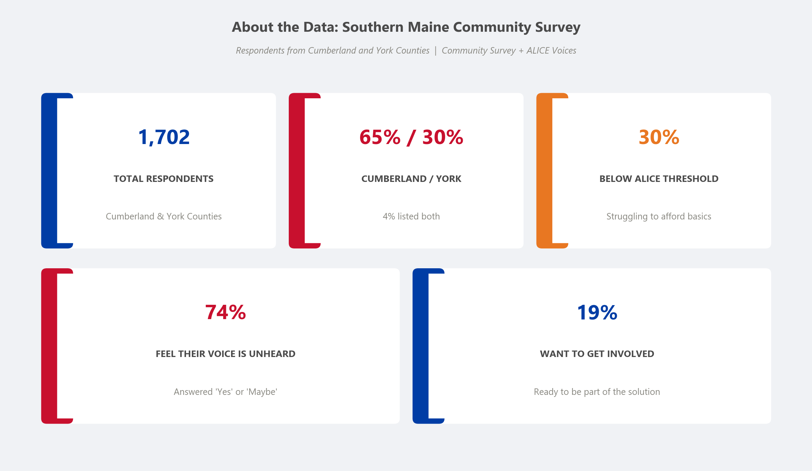
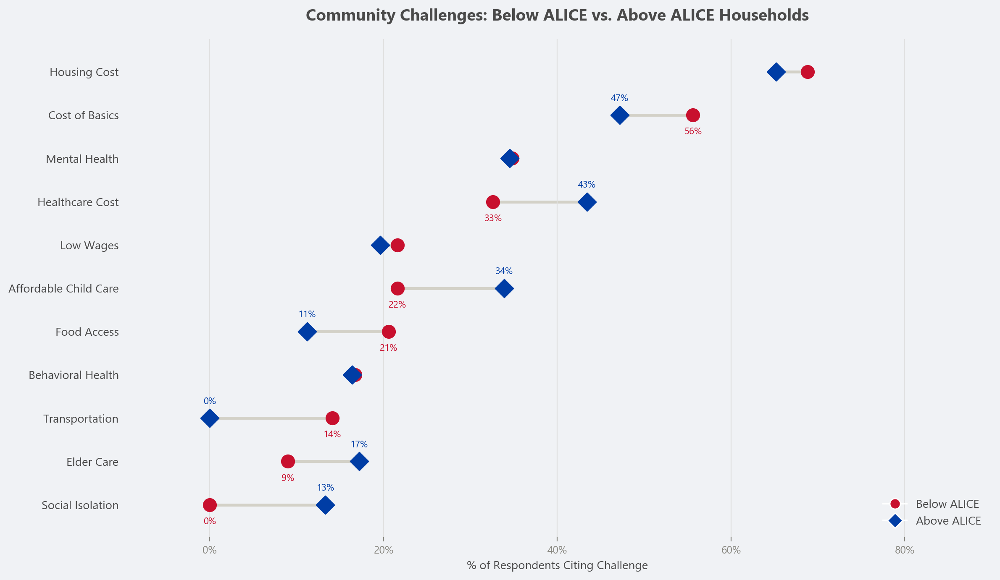
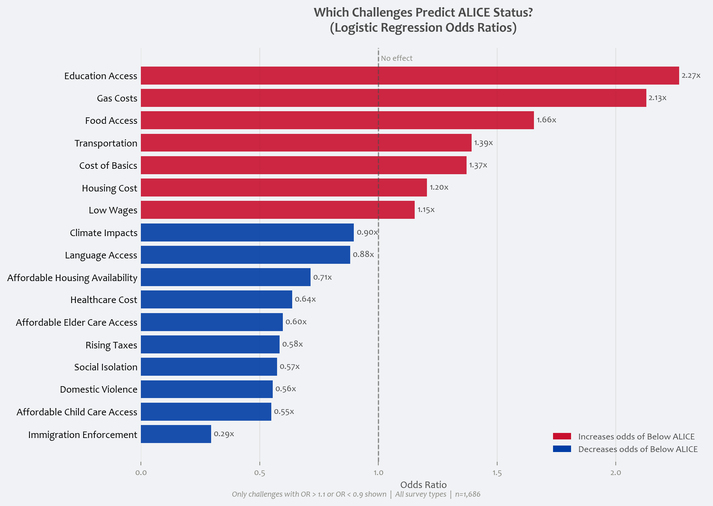
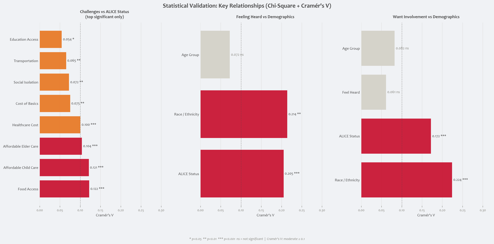
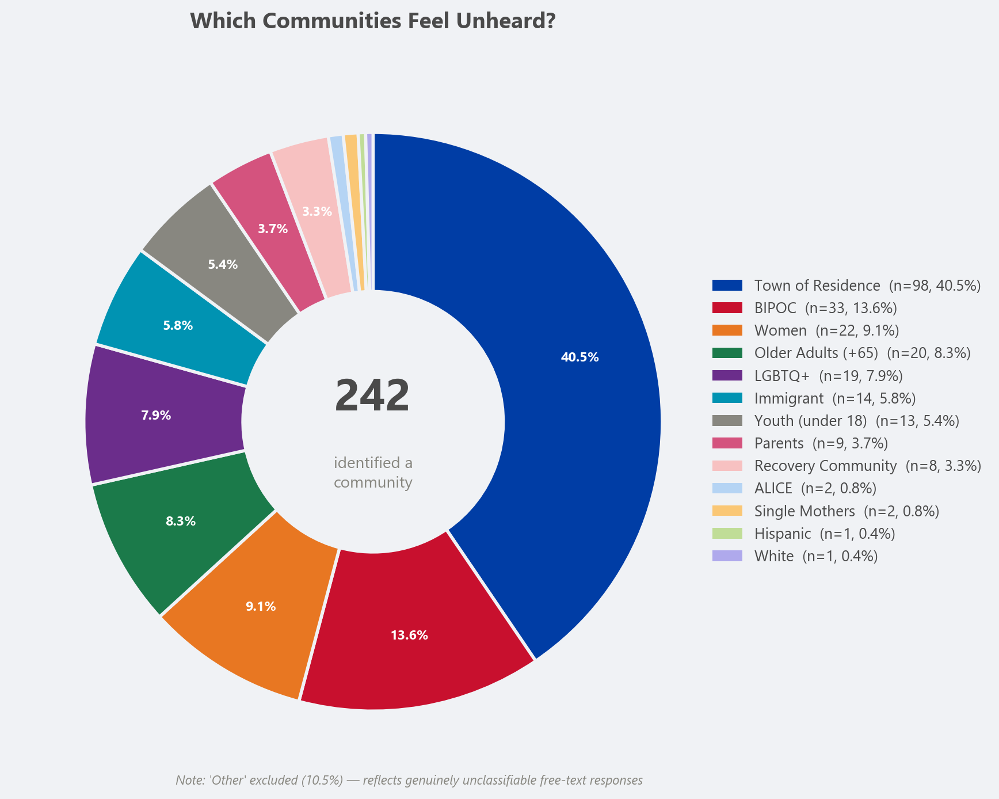
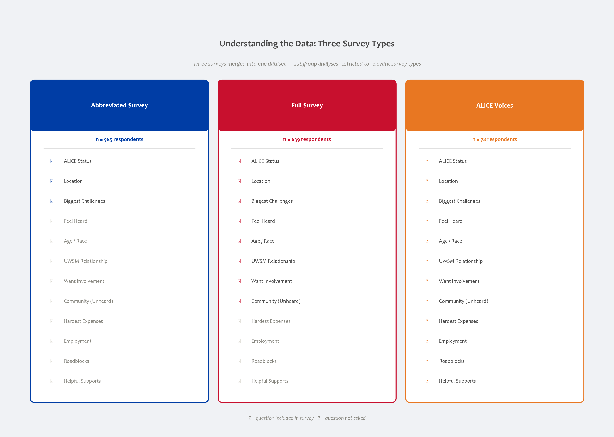

# Listening to Southern Maine

**A data-driven look at community challenges and civic engagement across Cumberland and York Counties.**

[](https://www.python.org/downloads/)
[](LICENSE)
[](https://jupyter.org/)
[](#authors)
[](#)

> A mixed-methods analysis of **1,702 community survey responses** collected by the United Way of Southern Maine (UWSM). We combine schema harmonization across heterogeneous survey instruments, NLP-based canonicalization of open-text responses, and classical statistical modeling to answer three questions: *what residents say their biggest challenges are*, *which challenges differ between economic strata*, and *who feels unheard and is ready to act*.

---

## TL;DR



**Three numbers tell the story.** Housing cost is cited by 82% of respondents — across every income group, every age group, every county. About one in three respondents is Below the ALICE threshold (above the federal poverty line but unable to afford basic local costs). And although a majority who answered the question report feeling unheard, only 19% say they want to get involved — a civic disconnect that doesn't map cleanly onto income or feeling-heard alone.

The repo contains the full analytical pipeline behind those numbers, plus a 25-page peer-style [report](report/final_report.pdf) and a 14-slide [community-facing deck](report/).

---

## Why this repo exists

UWSM had a stack of 1,889 community survey responses collected through eight different channels — three Q-and-A checkpoints, full survey, ALICE Voices instrument, workplace-giving touchpoints — none of them asking the same set of questions. The raw data is therefore a sparse, ragged matrix: 8 instruments × 18 questions, with most cells unasked rather than unanswered. The analytical problem is not just "what do residents say"; it's also a non-trivial data-engineering problem of unifying responses into a single analyzable schema without imputing coverage across instruments. That work is in the [`notebooks/`](notebooks/) and documented in [`docs/methods.md`](docs/methods.md).

---

## Headline findings

### 1. Housing cost is a cross-class crisis, not a poverty indicator

Below-ALICE and Above-ALICE respondents cite housing cost at almost the same rate (68.8% vs 65.2%). The chi-square test confirms no statistically significant difference. That's a meaningful programming finding: any housing-relief initiative framed exclusively as low-income support will structurally exclude the majority of people affected.



### 2. Below and Above ALICE households face structurally different problems

The two groups diverge sharply once you look past housing and mental health. Below-ALICE respondents cite **survival items** more often: food access (+10pp), transportation (+14pp), cost of basics (+9pp). Above-ALICE respondents cite **infrastructure-access items** more often: child care (+12pp), elder care (+8pp), healthcare cost (+10pp). The split is consistent across three independent methods — chi-square (Cramér's V 0.06–0.12), logistic-regression odds ratios, and decision-tree feature importances all pick out the same diagnostic features.



The counterintuitive piece: child care and elder care are cited *more* by Above-ALICE respondents — not because Below-ALICE households don't need those services, but because they're often eligible for subsidies (Head Start, Medicaid-funded elder care) that Above-ALICE households are priced out of while still being unable to afford market-rate care. This is the textbook benefit cliff, visible in the data.

### 3. Statistical validation: who differs from whom on what

We ran chi-square tests with Cramér's V across three families of relationships. Eight challenges differ significantly by ALICE status. Both feeling-heard and engagement-willingness are tied to race/ethnicity and ALICE status, but not to age.



### 4. The community that most often feels unheard isn't a demographic — it's a place

Free-text responses to "which community feels unheard?" were processed through a two-stage pipeline: a spaCy NER pre-filter to detect geographic entities, followed by zero-shot classification of the remainder against eleven identity categories. After classification, the single largest "unheard community" wasn't BIPOC, women, or older adults — it was **respondents' own town** (40.5%). That finding only became visible because the NLP pipeline could distinguish "Brunswick" from a demographic label.



### 5. Survey instrument structure determines what we can ask

Question coverage varies by instrument. The 985 respondents who took the abbreviated survey were never asked age, race, feel-heard, or engagement questions. Every subgroup analysis below is therefore restricted to the instruments that asked the relevant question, and missingness is structural rather than nonresponse.



---

## What's interesting here, methodologically

A short tour for the reader who cares about how the work was done — the long version lives in [`docs/methods.md`](docs/methods.md).

**Heterogeneous-schema harmonization.** Eight survey instruments, eighteen possible question slots, no two instruments overlapping the same set. We retain one row per respondent indexed by `Unique ID`, harmonize columns into a canonical schema, and conduct every subgroup analysis on the variable-specific non-missing subset rather than assuming a single common questionnaire. Missingness is treated as a property of the instrument, not the respondent.

**Free-text canonicalization with a hybrid pipeline.** The biggest-challenge field has fourteen predefined checkboxes plus a write-in. Write-ins are classified against ten additional canonical categories using `facebook/bart-large-mnli` zero-shot classification with a 0.30 confidence threshold; anything below threshold drops into `Other`. The community field is harder — it's free text with no checkbox prefilter — so it gets a two-stage pipeline: a spaCy NER detector for geographic entities (`GPE`/`LOC`) with a manually constructed dictionary of Southern Maine town names, followed by zero-shot classification of the remainder against eleven community categories at a 0.25 threshold. Final classification rate: 89.5%.

**Three classifier views of the same problem.** To validate that the challenge profile a respondent reports actually carries economic-status signal, we fit three models predicting Below-ALICE status: a class-balanced logistic regression, a depth-4 decision tree, and PCA on the 24-feature challenge matrix. All three converge on the same diagnostic challenge set. None of them performs at deployment quality — the logistic regression hits F1=0.466 against a 30/70 class split — and that's substantively informative: challenge profiles are necessary but not sufficient to identify ALICE status. The survey captures lived experience; income classification needs structural variables (savings, debt, household composition) that aren't in the instrument.

**Effect-size discipline.** With n ≈ 1,700, almost anything reaches statistical significance. We report Cramér's V alongside every p-value and apply the conventional thresholds (V < 0.1 weak, 0.1 ≤ V < 0.3 moderate, V ≥ 0.3 strong) so the substantive size of effects can be read off the numbers, not just their significance.

---

## Repo structure

```
united_way_final/
├── README.md                        ← this file
├── LICENSE
├── .gitignore
├── requirements.txt
│
├── notebooks/
│   ├── 01_cleaning_processing.ipynb ← raw Excel → cleaned + classified CSV
│   └── 02_analysis.ipynb            ← descriptives, stats, ML, figures
│
├── figures/                         ← all 16 PNGs used in the report and deck
│
├── report/
│   ├── final_report.pdf             ← 25-page peer-style writeup
│   └── presentation.pdf             ← 14-slide community-facing deck
│
├── docs/
│   ├── methods.md                   ← plain-English walkthrough of every method
│   ├── findings_summary.md          ← 2-page exec summary version of the report
│   └── data_dictionary.md           ← schema reference for the processed dataset
│
└── data/                            ← (gitignored; see data/README.md)
```

---

## Getting set up

Python 3.9 or newer. We recommend a virtual environment.

```bash
git clone https://github.com/myhott163com/united_way_final.git
cd united_way_final

python -m venv .venv
source .venv/bin/activate            # Windows: .venv\Scripts\activate

pip install -r requirements.txt
python -m spacy download en_core_web_sm
```

The notebooks expect input files under `data/`:

- `UWSM Community Data 4-1-2026.xlsx` — raw survey (needed for `01_cleaning_processing.ipynb`)
- `processed_data_5.csv` — cleaned dataset (output of notebook 01, input to notebook 02)

If you have `processed_data_5.csv` already, you can skip directly to `02_analysis.ipynb`. The cleaning notebook downloads `facebook/bart-large-mnli` (~1.6 GB) on first run and takes 10–30 minutes on GPU or several hours on CPU; the analysis notebook runs in a few minutes.

The data files are not in the repo. See [`data/README.md`](data/README.md) for how to obtain them.

---

## Authors

**Hangliang Ren** — analysis, statistical modeling, visualization, write-up. ([@myhott163com](https://github.com/myhott163com))

**Muhammad Marzouk Baig** — data cleaning pipeline, NLP classification, codebook design.

This was a collaborative MSc-level project at Northeastern University in partnership with the United Way of Southern Maine, completed in spring 2026.

---

## Acknowledgments

Thanks to the United Way of Southern Maine for sharing the data and to the 1,889 Southern Maine residents who took the time to respond to the survey. The interpretive frame builds on [United For ALICE](https://www.unitedforalice.org/) and the academic literature on the benefit cliff.

---

## License

MIT — see [LICENSE](LICENSE).
